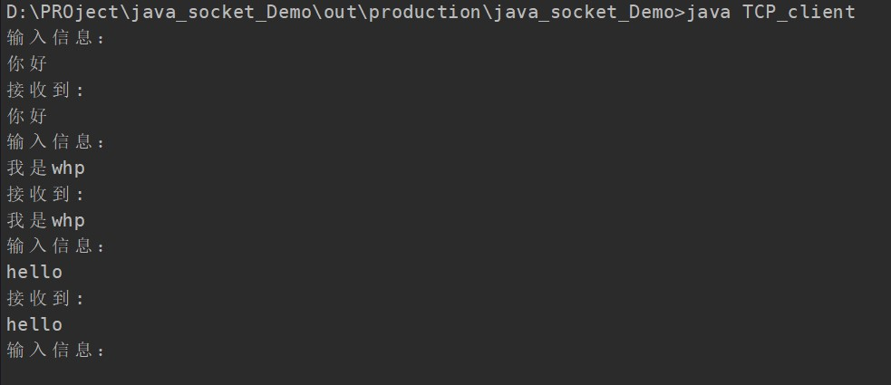

# 本项目主要是用java实现socket编程并抓包分析
集体要求包括，分别用tcp和udp实现socket客户端和服务端

使用Wireshark抓包分析

## ToDo
- [x] TCP服务端
- [x] TCP客户端
- [x] UDP服务端
- [x] UDP客户端
- [x] 抓包

## TCP客户端

客户端和服务端建立连接后客户端可以不断发送消息然后接收服务端返回的消息

## TCP服务端

不断接收客户端发送的消息然后将数据发回去

## udp客户端 

发送数据报文给服务端,然后退出

## udp服务端

接受数据报内容然后将内容打印在屏幕上

## 抓包结果
tcp

udp

